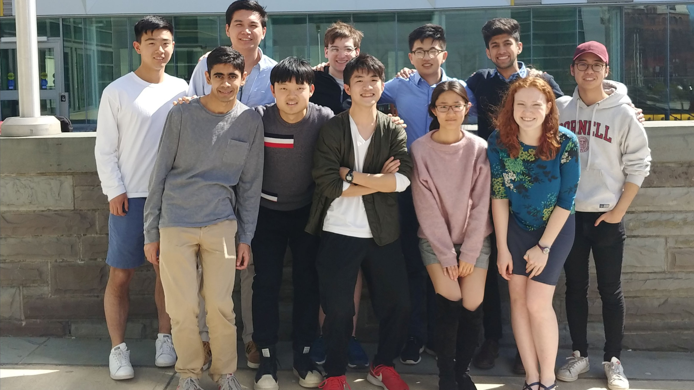

# Data Visualization
Data Vis Subteam

**Team Leads:** [Linnea May](https://github.com/linnealovespie) (CS '21) and [Kenta Tatsaku](https://github.com/Kenta426) (CS '19)  
**Advisor:** [Prof. Jeff Rzeszotarski](https://jeffrz.com/)

## About Us
The Data Visualization (DE) team is one of the three subteams in [Cornell Data Science](cornelldata.science), a student led undergraduate project team at Cornell University. We are a  new team of data scientists and designers dedicated to making sense of high-dimensional data and complex algorithms using visualization techniques. The field of data visualization is vast one and we're looking into topics such as visualizing high-dimensional data using T-SNE, visualizing deep learning conecpts, and creating tools to facilitate the machine learning development cycle. 

## Team Objectives
* Study machine learning algorithms as a team by visualizing them
* Find patterns in large datasets to guide future actions
* Create tools that help users better understand their datasets
* Make data science into an accessible topic for any audience

## This Semester
For our first semester we are working on building up the team and our projects, with a strong focus on visualizing how different algorithms in the field of data science function. 

### [**Social Tribes**](https://github.com/CornellDataScience/Social-Tribes)  
Visualizing the clustering of political figures on Twitter.  
Members: Andrew Tsarikis, Danny Yang, Kevin Ngo, Max Chen, Sam Kitterman, Shalin Mehta  

### [**Wikipedia**](https://github.com/CornellDataScience/Wikipedia)  
 Visualizing the hierarchial structure of knowledge using Wikipedia articles.   
 Members: Jim Li, Linnea May, Nikhil Saggi, Xinqi Lyu, Ziwei Gu

  
