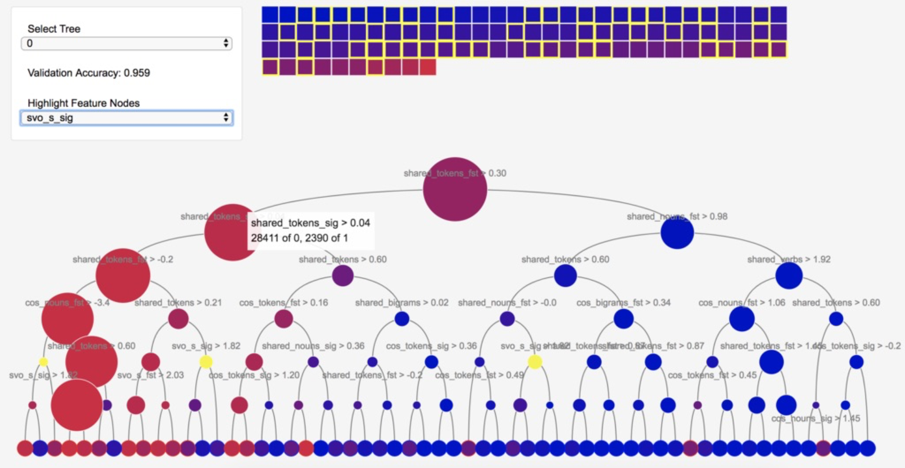
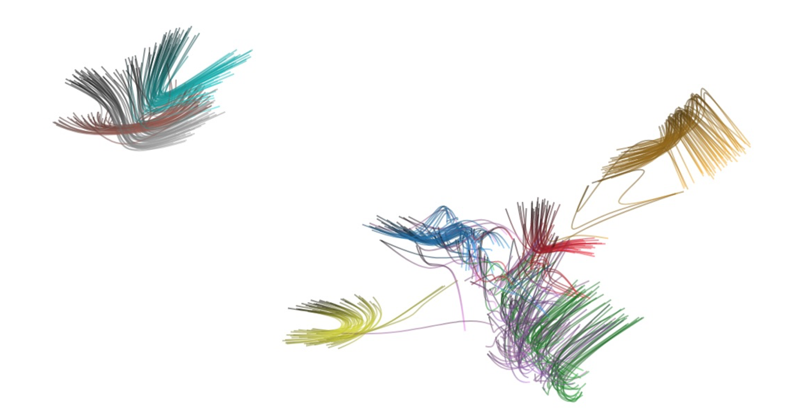
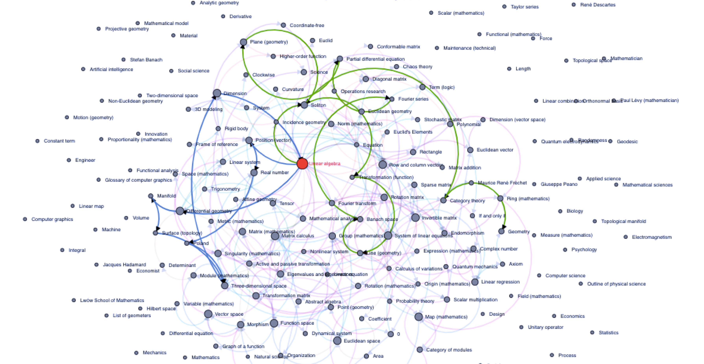

# Insights
Insights Subteam

**Team Leads:** [Linnea May](https://github.com/linnealovespie) (CS '21) and [Max Chen](https://github.com/maxlchen) (CS '21)  
**Advisor:** [Prof. Jeff Rzeszotarski](https://jeffrz.com/)

## About Us
The Insighs team is one of the three subteams in [Cornell Data Science](cornelldata.science), a student led undergraduate project team at Cornell University. Our goal is to provide insight into complex systems through a combination of data science and visual interfaces. Our work is interdisciplinary and unique - our projects range from visualizing neural network training to applying natural language processing and deep learning towards detecting fake news.

## Current Projects
### [**Fake News**](https://github.com/CornellDataScience/Insights-FakeNews)  

  

Analyzing and visualizing methods to identify fake news. 

Members: Danny Yang, Linnea May, Eric Sun, Kathy JaYoung Byun

### [**Spotify Recommendations**](https://github.com/CornellDataScience/Insights-SpoRe)  

Creating a new, more intuititve interface for recommending songs on Spotify. 

Members: Brandon Truong, James Chen, Max Chen, Shalin Mehta

### [**Knowledge Graphs**](https://github.com/CornellDataScience/Insights-Knowledge-Graphs)  

Compiling and visualizing a knowledge graph of academic articles. 

Members: Ziwei Gu, Jenny Chen, Kevin Ngo, Tushar Khan

### [**Comment Toxicity**](https://github.com/CornellDataScience/Insights-Comment-Toxicity)  

Identifying and visualizing the presence of toxic comments online. 

Members: Deb Bhattacharya, Nikhil Saggi, Ruchika Dongre 

## Past Projects
### [**Neural Network**](https://github.com/CornellDataScience/insights-vizNNs)  
*Fall 2018*

  

Building a tool to visualize the training progress of advanced neural networks architecture.     

Members: Linnea May, Jenny Chen
 
### [**Wikinsights**](https://github.com/CornellDataScience/Wikipedia)  
*Fall 2018*

  

Visualizing the hierarchial structure of knowledge using Wikipedia articles.    

Members: Nikhil Saggi, Xinqi Lyu, Ziwei Gu, Eric Sun, Deb Bhattacharya, Ellen Chen

### [**Social Tribes**](https://github.com/CornellDataScience/Social-Tribes)  
*Spring 2018* 

Analyzing the cluster of political journalists in Twitter through different unsupervised learning algorithms.
Our final project is available [here](http://www.unprofessionalperspective.com/posts/social-tribes.html).   
Members: Danny Yang, Max Chen, Shalin Mehta, Sam Kitterman, Kevin Ngo
  
